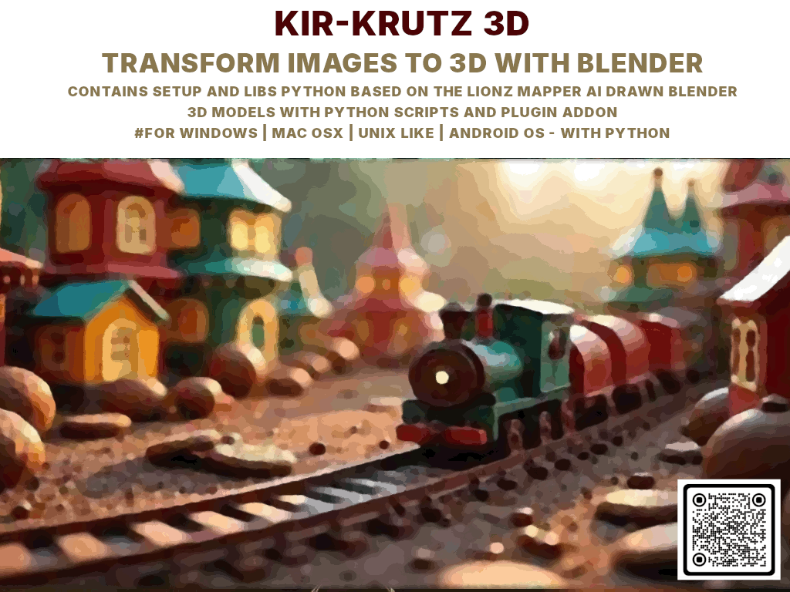

## KIR KRUTZ 3D

AI-Augmented Image → Axis Maps → Meshes → 3D Models → Sprites → Online Upload
(Featuring LionsMapper AI + Blender Pipeline + Multi-stage Generators)

Repository: github.com/ssmool/kirkrutz3d

🚀 Introduction

KIR KRUTZ 3D is an all-in-one AI-powered pipeline that turns ordinary bitmap images into 3D meshes, lithophanes, combined GLB models, spritesheets, and even automatic uploads via transfer.sh — all using a semi-modular stack of Python scripts, Blender automation, and LionsMapper AI.

🎯 Core Goal

“Take any image.
Scan it.
Detect color regions.
Extract vector spin-lines.
Generate 3D geometry.
Export everything automatically.
Render previews.
Upload final assets online.
All in one shot, while your coffee is still hot.”

😂 CLI Joke Intermission

Because every CLI needs a little personality:

If something crashes, it’s not a bug — it’s a “procedural feature.”

If your image has 4 million colors, that’s your fault, not ours.

If Blender freezes, gently whisper: “Good job, soldier” and try again.

💡 Why This Project Matters

The modern world is drowning in images — billions daily.
But images are flat. 3D is the future:

AR, VR, metaverse applications

game development asset generation

rapid prototyping

architecture forms

medical visualization

educational simulations

geometry-based AI experimentation

creative art, NFTs, 3D printing

KIR KRUTZ 3D automates the once-manual, painful process of:

Analyzing bitmap color regions

Extracting geometric axes using LionsMapper AI

Transforming color zones into 3D objects

Rendering, previewing, and combining meshes

Generating spritesheets for games or UI

Uploading assets automatically

It turns “raw pixels” into “ready-to-use assets” in minutes.

This is the kind of pipeline studios pay thousands for — now accessible to anyone with Python, Blender, and curiosity.

📦 Project Structure

The project is divided into 4 monolithic modules, each responsible for a stage in the AI+3D workflow:
